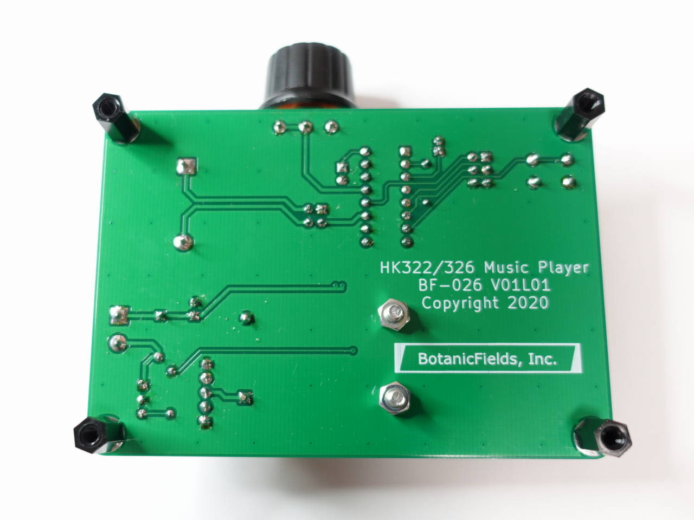
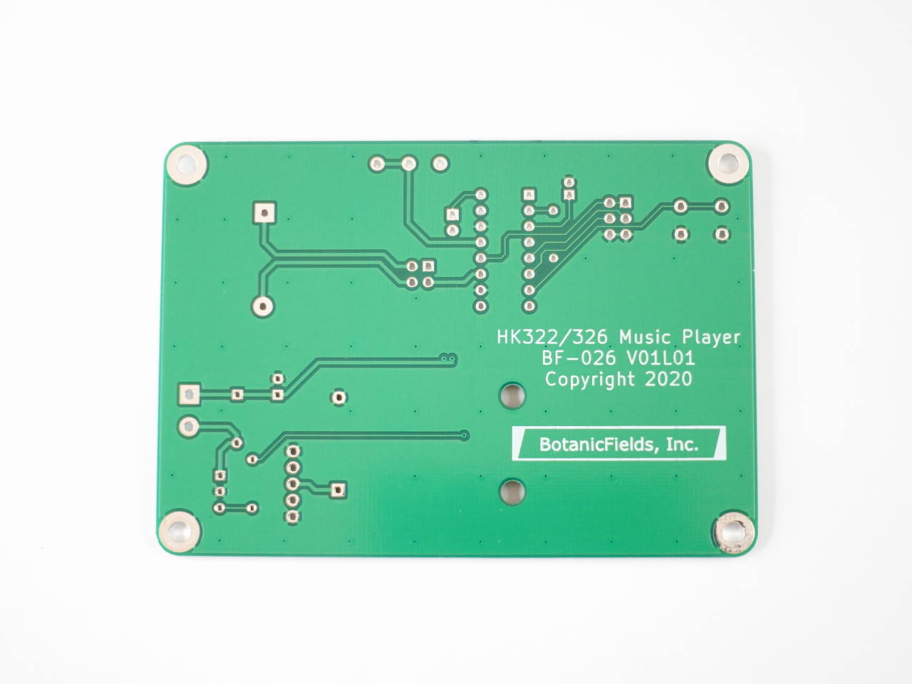

# HK322 Music Player

## メロディ IC HK322 HK326 基板キット

メロディ IC HK322 または HK326 の演奏を楽しめる組み立てキットです。プリント基板と部品のセットです。データシートの応用回路を実現できます。

単三乾電池 2 本を使用します。電池は付属しません。

モーターを接続できます。モーターは付属しません。

## **※音量が、かなり小さいです。**

[組み立て例]

[キット内容]

# 1.機能

- 基板上に小型スピーカーがあり、単体で演奏できます。
- 音量を調整できます。
- LED がテンポに合わせて点滅します。
- モーターの接続端子があり、演奏中に回せます。
- ボタン操作の動作モードを選べます。
- スピーカー出力をピンヘッダから外部に取り出せます。

[動作例 BF-026: HK322-6 Music Player (Speaker on Board)] https://youtu.be/cPjyi8aC4bo

# 2.組み立て

組み立てには、はんだ付けが必要です。はんだ、はんだごて、ニッパー等が必要です。ターミナルブロックへの導線の接続には、ドライバー等が必要です。

背の低い部品からプリント基板にはんだ付けするのがコツです。部品表の記号で部品を識別して取り付ける場所を確認してください。

ダイオードやトランジスタの向きに注意し、帯表示や外形を合わせてください。
LED にも極性があり、リード線の短い方がマイナスです。プリント基板上の K (Kathode) マークがマイナス側です。
電解コンデンサにも極性があり、リード線の短い方がマイナスです。

電池ホルダーのピンは、一旦まっすぐにしてから取り付けてください。皿ネジとナットで位置決めしてから、ピンをはんだ付けします。

SPEAKER 表示のピンヘッダー (4p) に、ショートピン 2 本をプリント基板の長い方向に並べて挿します。外部スピーカー等を使用する場合は、ショートピンを取り外して IC に近い方のピン 2 本から信号を取り出します。

[プリント基板]

# 3.動作

動作モードは、ピンヘッダー (6p) に対してショートピン 2 本で設定します。

| MODE | SL | 動作モード | TG ボタンの動作 |
|:--:|:--:|:---|:---|
| VSS | VSS | Play All Songs　| 全曲を 1 回演奏します |
| VSS | VDD | One Shot Re-Trigger | 1 曲目を演奏します。曲の途中で TG ボタンを押すと次の曲に移ります |
| VDD | VSS | One Shot Non Re-Tregger　| 1 曲目を最後まで演奏します。演奏後 TG ボタンを押すと次の曲を最後まで演奏します |
| VDD | VDD | On/Off Switch　|  全曲を 1 回演奏します。演奏中に TG ボタンを押すと演奏を停止します |
| VSS | VSS | TG = VSS: Power On/Off　| TG を VSS と短絡しておくと、電源オンで全曲を 1 回演奏します |

# 4. スピーカーについて

添付の圧電スピーカーを以下の部品に交換すると、音量や音質を改善できます。しかし基板上の VR による音量調節は、ほとんどできなくなります。

[基板取付用スピーカーユニット　ＵＧＳＭ３０Ｂ－８－０１]https://akizukidenshi.com/catalog/g/gP-09271/

※プリント基板が両面スルーホールのため、一旦取り付けた部品を交換するのは難易度が高いです。特にスピーカーは構造が華奢で壊れやすいです。外付けで大きなスピーカーに接続する方が安全です。

[動作例 BF-026: HK-322-6 Music Player (Speaker External)] 

Https://youtu.be/JqZQZIhNCvg

# 5.参考資料

メロディ IC の機能、動作の詳細、曲目の違いなどは、リンク先を参照ください。

- HK322, HK326 メーカー:

[Honsitak Electronics Co., Ltd.] https://www.honsitak-taiwan.com/products03.htm

- 小売：株式会社秋月電子通商

[HK322-1] https://akizukidenshi.com/catalog/g/gI-15483/

[HK322-3] https://akizukidenshi.com/catalog/g/gI-15484/

[HK322-6] https://akizukidenshi.com/catalog/g/gI-15485/

[HK326-2] https://akizukidenshi.com/catalog/g/gI-15486/

# 6.提供元

BotanicFields, Inc.

[twitter] https://twitter.com/botanicfields

[facebook] https://www.facebook.com/botanicfields

[Qiita] https://qiita.com/BotanicFields

[GitHub] https://github.com/botanicfields

[SwitchScience] https://www.switch-science.com/catalog/list/1084/

Copyright 2021 BotanicFields, Inc.
